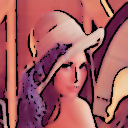

# cartoon_rendering
Cartoon Rendering using Python

## 알고리즘
1. 스무딩을 위한 블러 처리
2. 엣지 검출
3. 색상 축소 (bilateral filtering 사용)
4. 엣지와 색상을 결합하여 만화 효과 적용

## 샘플
   
   
   

2번과 3번은 준수하게 처리되었지만, 1번은 노이즈처럼 보이는 문제가 발생함

## 한계점
- 색상 축소를 위한 bilateral filtering을 사용하였는데, 이 때문에 색상이 너무 선명해지는 문제가 발생함
- 첫번째 샘플처럼 텍스처가 많은 이미지에서 노이즈처럼 보이는 문제가 발생함
- 배경이 복잡하다면 엣지 검출이 제대로 이루어지지 않아서 배경이 객체를 제대로 강조하지 못하는 문제가 발생함. 2번 샘플에서 약간 보여진다.
